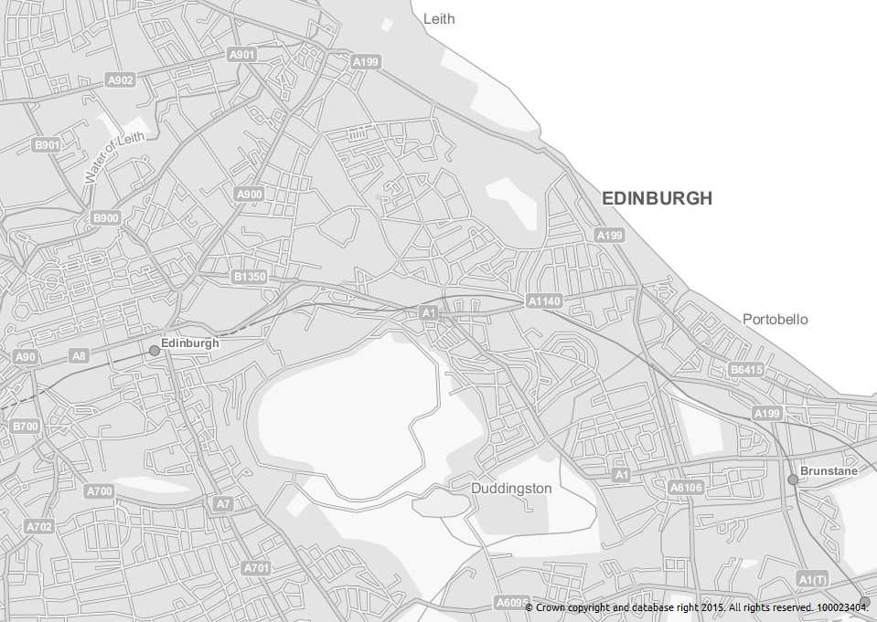
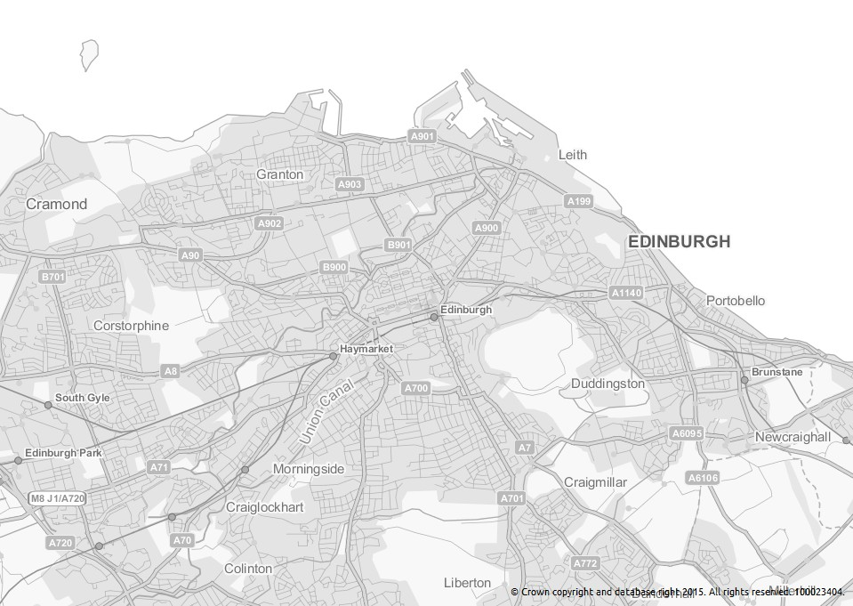
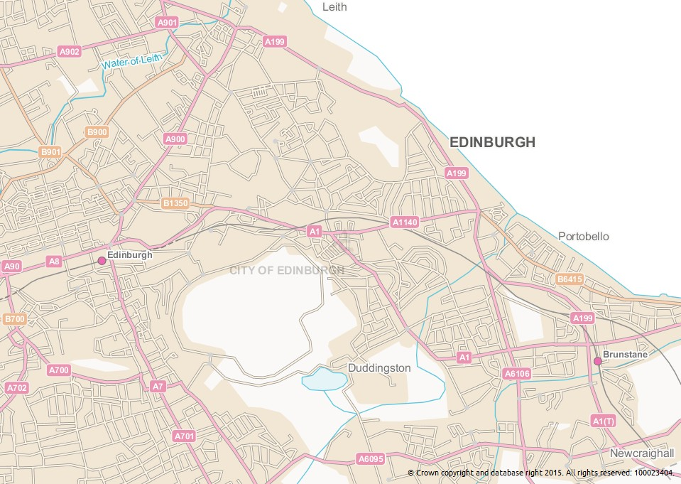
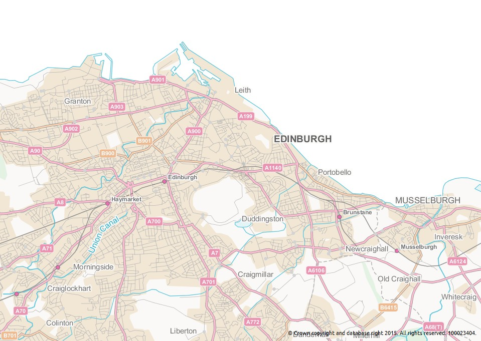

Geoserver-OS-SLDs
=================

Styled Layer Descriptor files for **OS Meridian2** layers in Geoserver.
These have been created for layers loaded from the OS OpenData shapefiles.

Based on the Ordance Survey's SLD files for their OnDemand WMS.
Ordnance Survey. &#169; Crown copyright and database rights 2012.

See http://www.ordnancesurvey.co.uk/business-and-government/help-and-support/products/styled-layer-descriptors.html for more information.

