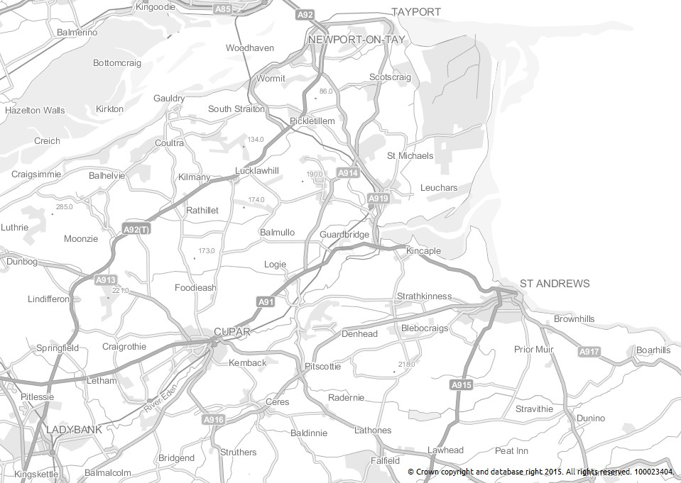
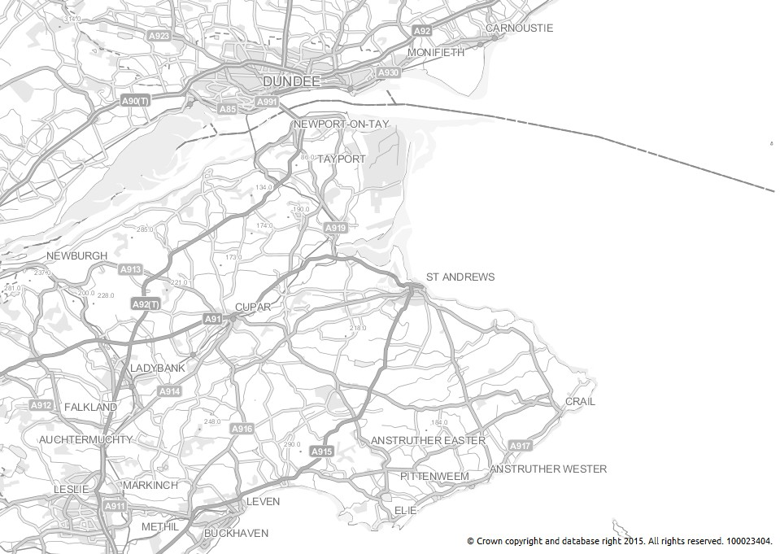

Geoserver-OS-SLDs: Strategi
===========================

Styled Layer Descriptor files for **OS Strategi** layers in Geoserver.
For layers loaded from the OS OpenData shapefiles.

Includes both backdrop and greyscale styles.

Based on the Ordance Survey's SLD files for their OnDemand WMS.
Ordnance Survey. &#169; Crown copyright and database rights 2012.

See http://www.ordnancesurvey.co.uk/business-and-government/help-and-support/products/styled-layer-descriptors.html for more information.

